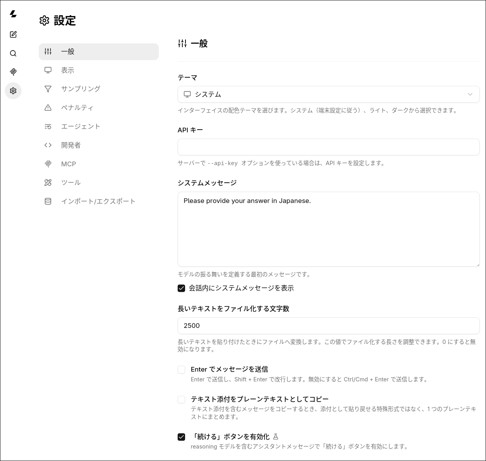
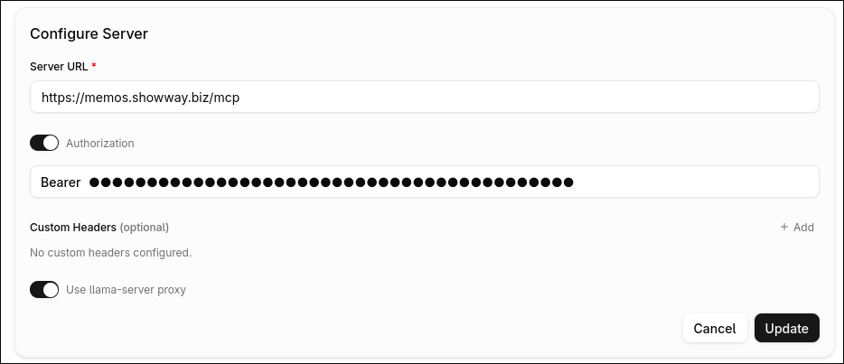

# llama.cpp 設定手順

このメモは `/etc/llama.cpp/models.ini` と
`/home/onoue/.config/systemd/user/llama.cpp.service` を使って、
`llama-server` を systemd user service として動かすための手順。

## 前提

- `llama-server` が `/usr/bin/llama-server` にある
- llama.cpp は AUR パッケージ `llama.cpp-cuda` で入れる
- モデル設定ファイルを `/etc/llama.cpp/models.ini` に置く
- llama.cpp の Web UI が `/home/onoue/src/oss/llama.cpp/tools/ui/dist` にある
- server は `127.0.0.1:8080` で待ち受ける

## インストール

Arch Linux では AUR の `llama.cpp-cuda` を使う。

```sh
yay -S llama.cpp-cuda
```

インストールされた場所を確認する。

```sh
command -v llama-server
pacman -Ql llama.cpp-cuda | grep '/llama-server$'
```

この設定では `/usr/bin/llama-server` を systemd から起動する。

## GPU/CUDA 確認

まず NVIDIA ドライバが見えているか確認する。

```sh
nvidia-smi
```

GPU 名、Driver Version、CUDA Version、VRAM 使用量が出ればドライバ側は見えている。
`NVIDIA-SMI has failed` が出る場合は、llama.cpp 以前に NVIDIA ドライバかカーネルモジュール側の問題。

`llama-server` のビルド情報を確認する。

```sh
llama-server --version
```

CUDA 対応ビルドかどうかは、起動ログで確認するのが確実。

```sh
llama-server -hf unsloth/gemma-4-E4B-it-GGUF:Q4_K_M \
  --n-gpu-layers 1 \
  --ctx-size 512 \
  --no-webui
```

CUDA が使えていれば、起動ログに CUDA / GPU backend の初期化ログが出る。
`failed to initialize CUDA` や `compiled without GPU support` が出る場合は、CUDA が使えていない。

## ディレクトリを作る

```sh
sudo mkdir -p /etc/llama.cpp
mkdir -p /home/onoue/.config/systemd/user
```

## chat-template の扱い

通常は `models.ini` に `chat-template-file` を書かない。
Hugging Face から取得する GGUF には chat template が含まれているので、llama.cpp 側に任せる。

`chat-template-file` を固定すると、モデル側や llama.cpp 側のテンプレート更新に追従できない。
古いテンプレートを使い続けると、tool calling、reasoning、system message、マルチモーダル対応などで不具合の原因になる。

カスタムしたい場合だけ `chat-template-file = /path/to/template.jinja` を追加する。
その場合はテンプレートの保守も自分でやる。

## モデル設定

`/etc/llama.cpp/models.ini` を作成する。

```ini
version = 1

[*]
ui = false

[gemma-4-E4B-it-qat]
ui = true
hf = unsloth/gemma-4-E4B-it-qat-GGUF:UD-Q4_K_XL
n-gpu-layers = all
ctx-size = 393216
parallel = 4
stop-timeout = 10
spec-type = draft-mtp
spec-draft-n-max = 4
temp = 1.0
top-p = 0.95
top-k = 64

[gemma-4-E4B-it]
ui = true
hf = unsloth/gemma-4-E4B-it-GGUF:Q4_K_M
n-gpu-layers = all
ctx-size = 393216
parallel = 4
stop-timeout = 10
spec-type = draft-mtp
spec-draft-n-max = 2
temp = 1.0
top-p = 0.95
top-k = 64

[ornith-1.0-9b]
ui = true
hf-repo = deepreinforce-ai/Ornith-1.0-9B-GGUF
hf-file = ornith-1.0-9b-Q4_K_M.gguf
n-gpu-layers = all
ctx-size = 65536
parallel = 1
stop-timeout = 10

[translategemma-4b]
ui = true
hf = mradermacher/translategemma-4b-it-GGUF:Q4_K_M
ctx-size = 16384
parallel = 4
n-gpu-layers = all
stop-timeout = 10

[translategemma-12b]
ui = true
hf = mradermacher/translategemma-12b-it-GGUF:Q4_K_M
ctx-size = 16384
parallel = 4
n-gpu-layers = all
stop-timeout = 10

[gemma4-coding-12b]
ui = true
model = /home/onoue/.local/lib/models/gemma4-coding-Q4_K_M.gguf
ctx-size = 65536
parallel = 1
n-gpu-layers = all
stop-timeout = 10

# [translategemma-4b-translate] / [translategemma-12b-translate]
# Local Translator や xTranslator 向けの設定
# c および parallel を 1 にセットし、GPU使用メモリを少なくして
# 両方を 12GB メモリに載せて、使いわけたい場合に使用する
# 単語や短文は 4b で高速に翻訳し、長文またはエラー時には 12b を使用する
[translategemma-4b-translate]
ui = true
hf = mradermacher/translategemma-4b-it-GGUF:Q4_K_M
ctx-size = 4096
parallel = 1
n-gpu-layers = 99
stop-timeout = 10

[translategemma-12b-translate]
ui = true
hf = mradermacher/translategemma-12b-it-GGUF:Q4_K_M
ctx-size = 4096
parallel = 1
n-gpu-layers = 99
stop-timeout = 10

[bonsai-27b]
ui = false
hf-repo = prism-ml/Bonsai-27B-gguf
hf-file = Bonsai-27B-Q1_0.gguf
n-gpu-layers = all
ctx-size = 65536
parallel = 1
stop-timeout = 10
```

### モデル指定の使い分け

`hf = repo:file-or-quant` は Hugging Face から取得する指定。

```ini
hf = unsloth/gemma-4-E4B-it-GGUF:Q4_K_M
```

`hf-repo` と `hf-file` はリポジトリと GGUF ファイル名を分ける指定。

```ini
hf-repo = deepreinforce-ai/Ornith-1.0-9B-GGUF
hf-file = ornith-1.0-9b-Q4_K_M.gguf
```

`ui = true` は Web UI に表示するモデル、`ui = false` は Web UI から隠すモデル。
`[*] ui = false` を先に書いておくと、明示的に `ui = true` を付けたモデルだけ Web UI に出せる。

## モデルを追加する手順

まず Hugging Face で使いたい GGUF リポジトリを選ぶ。
量子化は基本的に `Q4_K_M` から試す。VRAM に余裕があればより重い量子化、厳しければ軽い量子化に変える。

候補モデルを `llama-cli -hf` で単体起動して、最低限の応答を確認する。

```sh
llama-cli -hf unsloth/gemma-4-E4B-it-GGUF:Q4_K_M \
  --jinja \
  --n-gpu-layers all \
  --ctx-size 4096 \
  --parallel 1 \
  -p '日本語で短く自己紹介して。'
```

この時点では大きい `ctx-size` や `parallel` を狙わない。まずモデルが起動して、日本語で破綻せず返るかを見る。

次に Hugging Face のモデルカードや README を確認する。

- 推奨 chat template
- 推奨 temperature / top-p / top-k
- 推奨 context length
- reasoning / thinking の有無
- tool calling 対応の有無
- 量子化ごとの想定 VRAM
- ライセンスや用途制限

推奨値が書かれている場合は、それを `models.ini` に反映する候補にする。
推奨値が不明な場合は、まず保守的に `ctx-size = 4096`、`parallel = 1` で試す。
chat template は確認だけしておく。通常は GGUF 内蔵のものを使うので、`chat-template-file` は追加しない。

メモリ使用量を見ながら、`ctx-size` と `parallel` を上げる。

```sh
watch -n 1 nvidia-smi
```

調整の順番は次の通り。

1. `n-gpu-layers = all` で載るか確認する
2. `ctx-size` を実用に必要な長さまで上げる
3. `parallel` を必要な同時処理数まで上げる
4. VRAM が厳しければ `parallel`、`ctx-size`、量子化の順で下げる

CLI で問題なければ、次に一時的に server として起動して OpenAI 互換 API と Web UI で確認する。

```sh
llama-server -hf unsloth/gemma-4-E4B-it-GGUF:Q4_K_M \
  --host 127.0.0.1 \
  --port 18080 \
  --jinja \
  --n-gpu-layers all \
  --ctx-size 4096 \
  --parallel 1 \
  --path /home/onoue/src/oss/llama.cpp/tools/ui/dist
```

別ターミナルで API を確認する。

```sh
curl http://127.0.0.1:18080/v1/models
curl http://127.0.0.1:18080/v1/chat/completions \
  -H 'Content-Type: application/json' \
  -d '{
    "model": "v1-modelsで確認したモデルID",
    "messages": [
      {
        "role": "user",
        "content": "日本語で短く自己紹介して。"
      }
    ],
    "max_tokens": 128
  }'
```

Web UI も確認する。

```text
http://127.0.0.1:18080
```

確認すること。

- モデル一覧に出るか
- 日本語 UI で表示できるか
- チャットが返るか
- system message が効くか
- 長めの入力で落ちないか
- VRAM が想定内に収まるか

問題なければ `/etc/llama.cpp/models.ini` にセクションを追加する。

```ini
[new-model-name]
hf = owner/model-GGUF:Q4_K_M
ui = true
n-gpu-layers = all
ctx-size = 4096
parallel = 1
stop-timeout = 10
temp = 0.7
top-p = 0.95
top-k = 40
```

`hf-repo` と `hf-file` で分けて書く場合。

```ini
[new-model-name]
hf-repo = owner/model-GGUF
hf-file = model-Q4_K_M.gguf
ui = true
n-gpu-layers = all
ctx-size = 4096
parallel = 1
stop-timeout = 10
```

`models.ini` を変更したら service を再起動する。

```sh
systemctl --user restart llama.cpp.service
```

反映後に確認する。

```sh
systemctl --user status llama.cpp.service
journalctl --user -u llama.cpp.service -f
curl http://127.0.0.1:8080/v1/models
```

最後に Web UI から対象モデルを選んで、短文・長文・system message の動作を確認する。

## systemd user service

`/home/onoue/.config/systemd/user/llama.cpp.service` を作成する。

```ini
[Unit]
Description=llama.cpp server
After=network-online.target
Wants=network-online.target

[Service]
Type=simple
ExecStart=/usr/bin/llama-server \
  --host 127.0.0.1 \
  --port 8080 \
  --models-preset /etc/llama.cpp/models.ini \
  --models-max 1 \
  --jinja \
  --path /home/onoue/src/oss/llama.cpp/tools/ui/dist \
  --tools read_file,file_glob_search,grep_search,get_datetime \
  --cors-origins "moz-extension://ca462efa-9eb3-47a8-b32e-c8f6d7b859c9" \
  --ui-mcp-proxy
Restart=on-failure
RestartSec=3

[Install]
WantedBy=default.target
```

`--models-max 1` は同時ロードするモデル数の上限。VRAM を抑えたい場合はこのままでよい。

`--jinja` は Jinja chat template を有効にするために必要。
通常は GGUF 内の chat template を使うので、`models.ini` 側に `chat-template-file` は書かない。

`--path /home/onoue/src/oss/llama.cpp/tools/ui/dist` は llama.cpp の Web UI を差し替えるために使う。
この設定では、日本語化済みの Web UI dist を指定している。

`--tools` は llama.cpp のツール呼び出しで使えるビルトインツールを指定する。
この設定では読み取り・検索・日時取得だけを有効にしている。

```sh
--tools read_file,file_glob_search,grep_search,get_datetime
```

llama.cpp のビルトインツールは次の通り。

| tool | 内容 | 書き込み権限 |
| --- | --- | --- |
| `read_file` | ファイル読み取り | なし |
| `file_glob_search` | glob によるファイル検索 | なし |
| `grep_search` | grep 相当のテキスト検索 | なし |
| `exec_shell_command` | シェルコマンド実行 | あり |
| `write_file` | ファイル作成・上書き | あり |
| `edit_file` | 既存ファイルの部分編集 | あり |
| `get_datetime` | 日時取得 | なし |

`write_file` と `edit_file` は `llama-server` プロセスの OS 権限で動く。
この service は `systemctl --user` で起動するため、通常は `onoue` ユーザー権限になる。
つまり `onoue` が書ける場所には API 経由でも書ける。

llama.cpp 側のビルトインツールには、書き込み先を特定ディレクトリに閉じ込める chroot や専用 sandbox はない。
Web UI に出る `permissions.write = true` は確認表示用のメタ情報であり、OS 権限を制限するものではない。

`exec_shell_command`、`write_file`、`edit_file` を常駐 service で有効にする場合はかなり強い権限を渡すことになる。
必要になった場合だけ有効化し、`--host 127.0.0.1`、`--cors-origins` の制限、systemd の `ProtectHome=` や `ReadWritePaths=` などで実行範囲を絞る。

`--cors-origins "moz-extension://ca462efa-9eb3-47a8-b32e-c8f6d7b859c9"` は
Offline-llm-translator ブラウザ拡張機能から llama-server にアクセスするために必要。
拡張機能の ID が変わった場合は、この origin も差し替える。

`--ui-mcp-proxy` は llama-server の Web UI から MCP を使うために必要。

日本語化された Web UI の設定画面例。



この service を `systemctl --user` で常駐させておくと、`models.ini` に書いたモデル定義を
router server が読む。Hugging Face のモデルは、各セクションで `hf = repo:quant` の形で指定する。

```ini
[gemma-4-E4B-it]
hf = unsloth/gemma-4-E4B-it-GGUF:Q4_K_M
```

API リクエストで指定するモデル名は、起動後に `/v1/models` で確認する。

```sh
curl http://127.0.0.1:8080/v1/models
```

手元で毎回 `llama serve -hf repo/model:quant` を起動し直さなくて済むので、
Local Translator、xTranslator、OpenAI 互換クライアントから使いやすい。

## MCP を使う

llama.cpp Web UI から MCP サーバーを使う場合は、`llama-server` に `--ui-mcp-proxy` を付けて起動する。
この設定では systemd service に追加済み。

Web UI の MCP 設定では、ローカルや外部の MCP server URL を登録する。
ブラウザから直接 MCP サーバーへ接続して CORS で止まる場合は、`Use llama-server proxy` を有効にする。



### mcp-searxng

[`ihor-sokoliuk/mcp-searxng`](https://github.com/ihor-sokoliuk/mcp-searxng) は
SearXNG を MCP ツールとして使うためのサーバー。
llama.cpp Web UI から使う場合は、`mcp-searxng` を HTTP mode で起動し、Web UI の MCP 設定に登録する。

前提として SearXNG 側で JSON 出力が有効になっている必要がある。
SearXNG の `settings.yml` に `json` が入っているか確認する。

```yaml
search:
  formats:
    - html
    - json
```

SearXNG の JSON API が返るか確認する。

```sh
curl 'http://127.0.0.1:8088/search?q=test&format=json'
```

`127.0.0.1:8088` は SearXNG の URL に合わせて変える。

`mcp-searxng` をインストールする。

```sh
npm install -g mcp-searxng
```

HTTP mode で起動する。

```sh
SEARXNG_URL=http://127.0.0.1:8088 \
MCP_HTTP_PORT=3000 \
mcp-searxng
```

疎通確認。

```sh
curl http://127.0.0.1:3000/health
```

systemd user service として常駐させる場合は
`/home/onoue/.config/systemd/user/mcp-searxng.service` を作成する。

```ini
[Unit]
Description=mcp-searxng server
After=network-online.target
Wants=network-online.target

[Service]
Type=simple
Environment=SEARXNG_URL=http://127.0.0.1:8088
Environment=MCP_HTTP_PORT=3000
ExecStart=/usr/bin/env mcp-searxng
Restart=on-failure
RestartSec=3

[Install]
WantedBy=default.target
```

反映する。

```sh
systemctl --user daemon-reload
systemctl --user enable --now mcp-searxng.service
systemctl --user status mcp-searxng.service
```

llama.cpp Web UI 側では MCP サーバーに次を追加する。

```json
[
  {
    "id": "searxng",
    "name": "SearXNG",
    "url": "http://127.0.0.1:3000/mcp",
    "enabled": true,
    "requestTimeoutSeconds": 300,
    "useProxy": true
  }
]
```

`useProxy = true` は llama-server の `--ui-mcp-proxy` を経由して MCP サーバーへ接続するための指定。
ブラウザからローカル MCP サーバーへ直接アクセスして CORS で止まる場合でも、proxy 経由なら使える。

Web UI で接続できたら、MCP ツール一覧に `searxng_web_search` と `web_url_read` が出る。
検索が失敗する場合は、まず SearXNG の JSON API と `mcp-searxng` の `/health` を確認する。

### Memos MCP

[`usememos/memos`](https://github.com/usememos/memos) は組み込み MCP server を持っている。
別プロセスの MCP server を追加で立てる必要はない。
Memos v0.27.0 以降では、Memos 本体の `/mcp` endpoint を Streamable HTTP transport として使える。

Memos 側で Personal Access Token を作成する。

1. Memos のユーザー設定を開く
2. Access Tokens で新しい token を作る
3. 表示された token を控える

Web UI の MCP 設定に次を登録する。

```json
[
  {
    "id": "memos",
    "name": "Memos",
    "url": "https://memos.showway.biz/mcp",
    "enabled": true,
    "requestTimeoutSeconds": 300,
    "useProxy": true
  }
]
```

Authorization を有効にして、Bearer token を設定する。

```text
Bearer memos_pat_...
```

`useProxy = true` は llama-server の `--ui-mcp-proxy` を経由して Memos に接続するための指定。
ブラウザから Memos の `/mcp` に直接接続して origin check や CORS で止まる場合でも、proxy 経由なら使える。

接続できたら、MCP ツール一覧に Memos のツールが出る。
代表的なツールは次の通り。

- `memo_list_memos`
- `memo_create_memo`
- `memo_get_memo`
- `memo_update_memo`
- `memo_delete_memo`
- `memo_list_memo_comments`
- `memo_create_memo_comment`
- `attachment_list_attachments`
- `auth_get_current_user`

認証エラーになる場合は token を作り直す。
`403` になる場合は、Memos 側の instance URL / origin 設定か、Web UI 側の proxy 設定を確認する。

### あとで試したい MCP 候補

llama.cpp Web UI に追加する MCP は、まず HTTP / SSE / Streamable HTTP で公開できるものを選ぶ。
stdio 専用の MCP server は Web UI に URL として直接登録できないため、HTTP 変換用の proxy や adapter を挟む。

優先して試したい候補。

| 候補 | 用途 | 方針 |
| --- | --- | --- |
| fetch / URL reader | SearXNG で見つけた URL の本文取得 | 検索結果を読むために最優先で試す |
| filesystem | ローカルのメモ、README、設定、ログの参照 | read-only か許可ディレクトリ限定で使う |
| git | リポジトリの差分、履歴、コミット情報の確認 | まず読み取り用途だけで使う |
| memory | 軽い永続メモリ | Memos と役割がかぶるため、使い分けを決めてから入れる |
| sqlite / database reader | ローカル DB やアプリ DB の調査 | 読み取り専用ユーザーで接続する |
| Playwright / browser automation | Web ページの実表示、スクリーンショット、UI 確認 | 権限が強いのでローカル限定で試す |
| MarkItDown 系 | PDF、Office、HTML などを Markdown 化 | 資料読み込み用に便利 |

この環境では、すでに `mcp-searxng` と Memos MCP がある。
次に入れるなら、検索結果を読めるようにする fetch / URL reader、ローカル情報を読める filesystem read-only、repo を読める git read-only の順が使いやすい。

MCP server はプロセスの実行権限でファイル、ネットワーク、外部コマンドに触れるものがある。
常駐させる場合は read-only、ローカル待ち受け、必要なディレクトリだけ許可、token は環境変数で渡す、を基本にする。

## サービスを反映する

```sh
systemctl --user daemon-reload
systemctl --user enable --now llama.cpp.service
```

ログアウト後も user service を動かしたい場合は linger を有効にする。

```sh
sudo loginctl enable-linger onoue
```

SSH セッションやデスクトップセッションを閉じても `llama.cpp.service` を常駐させたいなら、ほぼ必要。

設定を変えたあとに再起動する。

```sh
systemctl --user restart llama.cpp.service
```

## 状態確認

```sh
systemctl --user status llama.cpp.service
journalctl --user -u llama.cpp.service -f
```

API の疎通確認。

```sh
curl http://127.0.0.1:8080/v1/models
```

OpenAI 互換 API の実行確認。

```sh
curl http://127.0.0.1:8080/v1/chat/completions \
  -H 'Content-Type: application/json' \
  -d '{
    "model": "translategemma-4b-translate",
    "messages": [
      {
        "role": "user",
        "content": "こんにちは。短く自己紹介して。"
      }
    ],
    "temperature": 0.7,
    "max_tokens": 128
  }'
```

JSON の `"model"` には `/v1/models` で見えるモデル ID を指定する。

Web UI はブラウザで開く。

```text
http://127.0.0.1:8080
```

## モデル保存先

`llama serve -hf モデル名` を使うと、Hugging Face からモデルがダウンロードされる。

```sh
llama serve -hf unsloth/gemma-4-E4B-it-GGUF:Q4_K_M
```

この場合、モデルは Hugging Face のキャッシュ配下に保存される。

```text
/home/onoue/.cache/huggingface/
```

Hugging Face 上のモデルが更新された場合も、キャッシュ側は必要に応じて更新される。
モデル取得と更新確認を llama.cpp 側に任せられるので、手で GGUF を探して落としてくる手間が減る。

この README の systemd 設定では、基本的にモデル取得を
`hf` / `hf-repo` / `hf-file` に任せる。
`/etc/llama.cpp/models.ini` には、各セクションごとにモデル取得元を書く。

```text
[translategemma-4b-translate]
hf = mradermacher/translategemma-4b-it-GGUF:Q4_K_M
```

キャッシュ内のモデル一覧はこれで確認する。

```sh
llama-server --cache-list
```

ディスク使用量を見る。

```sh
du -sh /home/onoue/.cache/huggingface
```

GGUF は数 GB から数十 GB になる。複数モデルを試すなら、空き容量を先に見ておく。

## VRAM 調整指針

VRAM 使用量に効く主な設定は `ctx-size`、`parallel`、`n-gpu-layers`、`--models-max`。

- `ctx-size` はコンテキスト長。大きいほど KV cache が増える。
- `parallel` は同時処理数。増やすとスロット分のメモリが増える。
- `n-gpu-layers` は GPU に載せるレイヤ数。`all` は可能な限り GPU に載せる。
- `--models-max` は同時ロードするモデル数。この設定では `1` にして VRAM を抑えている。

起動に失敗する、または推論中に VRAM が足りない場合は、まずこの順で下げる。

1. `parallel` を `1` にする
2. `ctx-size` を下げる
3. `n-gpu-layers = all` を数値指定にする
4. 同時に使わないモデルを unload する、または `--models-max 1` を維持する
5. 量子化の軽い GGUF に変える

翻訳用の `translategemma-4b-translate` / `translategemma-12b-translate` は、
`ctx-size = 4096`、`parallel = 1` にして VRAM を抑える設定。

## 翻訳用モデルの考え方

`translategemma-4b-translate` と `translategemma-12b-translate` は
Local Translator や xTranslator 向けの軽量設定。

- `ctx-size = 4096` で KV cache の使用量を抑える
- `parallel = 1` で同時処理数を抑える
- `n-gpu-layers = 99` で GPU 使用量を固定寄りにする
- 短文は 4B、長文やエラー時は 12B という使い分けを想定する

通常チャット用の `translategemma-4b` と `translategemma-12b` は
`ctx-size = 16384`、`parallel = 4` にしているので、翻訳専用設定よりメモリを使う。

## 注意点

- `ctx-size` と `parallel` を大きくすると KV cache が増えて VRAM 使用量も増える。
- `n-gpu-layers = all` は可能な限り GPU に載せる設定。VRAM が足りない場合は数値指定に落とす。
- `hf` / `hf-repo` / `hf-file` を使うモデルは、初回起動時にダウンロードが必要になる。
